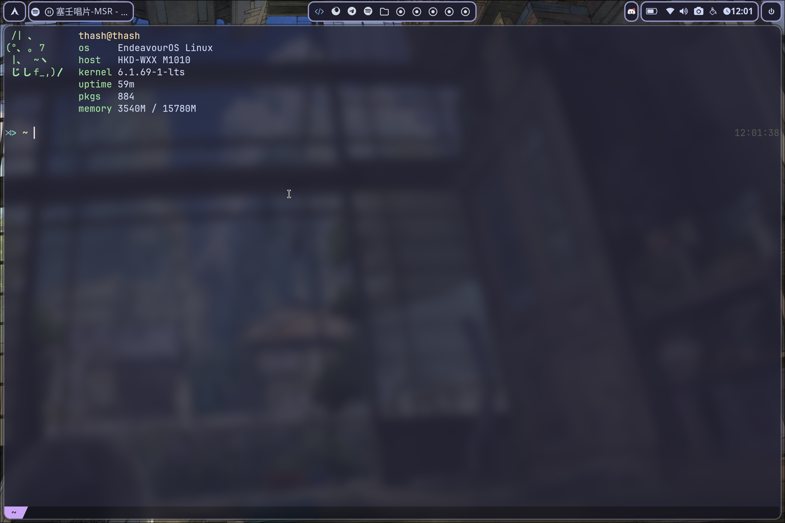

# dotfiles

[//]: # ()

## WM: [i3](https://i3wm.org/)
Simple and effective window manager, easy to setup, easy to comprehend. Really loving it
Nitrogen is used for wallpaper.

## Bar: [i3status-rust](https://github.com/greshake/i3status-rust)
Simple and effective, easy to setup (again). Recommended

## Terminal : [Kitty](https://sw.kovidgoyal.net/kitty/)
Basic kitty terminal with a nice theme (see below)

## [Fish](https://fishshell.com/)
Simple fish config with personnal aliases

## Neovim
Config started with [Kickstart](https://github.com/nvim-lua/kickstart.nvim) to learn Neovim on my own. 
Very barebone config for my personnal enjoyment. 

## Notification
[dunst](https://github.com/dunst-project/dunst)

[//]: # ()

## Theme used: [Catppuccin](https://github.com/catppuccin/catppuccin)

## Stowing my dotfiles
Currently using [stow](https://www.gnu.org/software/stow/) to manage my dotfiles with this current folder/repository.
Takes this folder for example :
- Put it in your home directory (~/dotfiles)
- use : ```stow .```
- ```ls -lah ~/.config/i3```
- the config file is then symlinked with the one inside the dotfiles folder.

If you don't want your config files to be messed up but you still want to stow them, you can use ```--adopt``` command to get them inside the ```~/dotfiles``` folder and then symlink them. use ```man stow```
